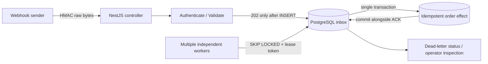

# Architecture & trade-offs

This is a stand-alone example adapted from patterns used in Amoozyar's
Commerce Webhook ingestion code. It is **not** a copy of customer order data,
WordPress connector credentials or the original commercial codebase.

## The problem being solved

An HTTP webhook can be retried, delivered twice, arrive concurrently and fail
between acknowledgement and domain processing. A fast HTTP 200 that merely
fires a background promise is not durable.

This example persists an event **before** returning 202. Its unique
`(tenant_id, event_id)` constraint prevents duplicate inbox rows. A duplicate
ID with different signed raw bytes returns 409.

## Authentication

- Per-tenant secrets come from `WEBHOOK_SECRETS_JSON` (environment only).
- SHA-256 HMAC covers the exact raw received bytes preceded by
  `<unix-seconds>.`.
- Timestamp is checked against a five-minute window; comparisons use
  `timingSafeEqual`. Missing/duplicated headers are rejected.
- The body is a deliberately small example contract:
  `{eventId,orderId,kind:"order.paid"}`.
- Only event metadata is recorded; never log raw payload or credentials.
- **Not a network-level rate limiter**. Configure request limits, WAF,
  secret rotation and TLS termination at the deployment boundary.

## Durable claims and recovery

- Workers use `SELECT ... FOR UPDATE SKIP LOCKED` to atomically claim due
  events, recording `lock_token`, `locked_until` and `attempts`.
- An expired claim may be reclaimed by another worker. Every
  transaction checks the *current* lease token; stale workers cannot
  acknowledge a later worker's claim.
- A failure schedules a retry with capped backoff and jitter. Five failed or
  expired attempts dead-letter the event.
- Operators can inspect `status='dead'` and requeue **after correcting the
  cause**; the public HTTP API intentionally exposes no retry bypass.
- A completed event is not reprocessed by retries.

## What the consistency guarantee actually means

**Inbox processing is at-least-once.** The included illustrative
`processed_orders` effect is idempotent and committed in the exact same
PostgreSQL transaction that marks the inbox event complete. This gives
exactly-once **observable local effect** per `(tenant_id,order_id)`
under that constraint.

**External APIs are NOT exactly-once.** If a handler calls a third-party
payment service, sends email or publishes an event outside the transaction,
a crash can cause duplicate delivery. Real applications must propagate
idempotency keys and/or write an outbox in the same database transaction.

## Security/operational boundaries

- Multi-tenancy is by request HMAC/unique keys and explicit SQL predicates.
  **Not PostgreSQL RLS**; this is a demonstration, not a complete tenant
  authorization platform.
- No administration interface, metrics system or rate-limiter is shipped.
- The sample stores a full small JSON event. Real systems must define payload
  retention/deletion policies and avoid unnecessary personal information.
- PostgreSQL is a single point of failure in this minimal deployment;
  configure managed backups, pooling, monitoring and migration control.
- Database errors before INSERT acknowledgement intentionally fail the HTTP
  request so the sender can retry.

## Production-readiness checklist

- [ ] Configure TLS/WAF, request throttling and rotating per-tenant secrets
- [ ] Confirm sender replay and retry contract
- [ ] Verify payload size, schema, privacy and retention policy
- [ ] Set metrics/alerts for oldest pending, dead-letter rate and lease expiry
- [ ] Use idempotent downstream APIs (or transactional outbox) for external effects
- [ ] Perform load testing and chaos tests against your own workload
- [ ] Confirm code and sample provenance/licensing rights

Automated tests are evidence for a **reference implementation** only;
not a security or production certification.
